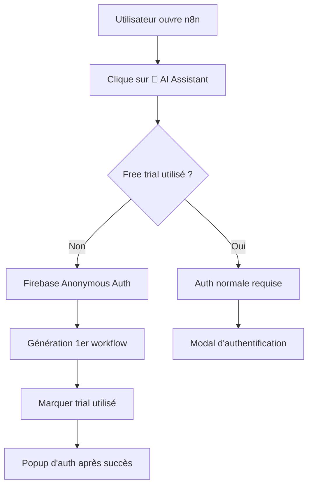
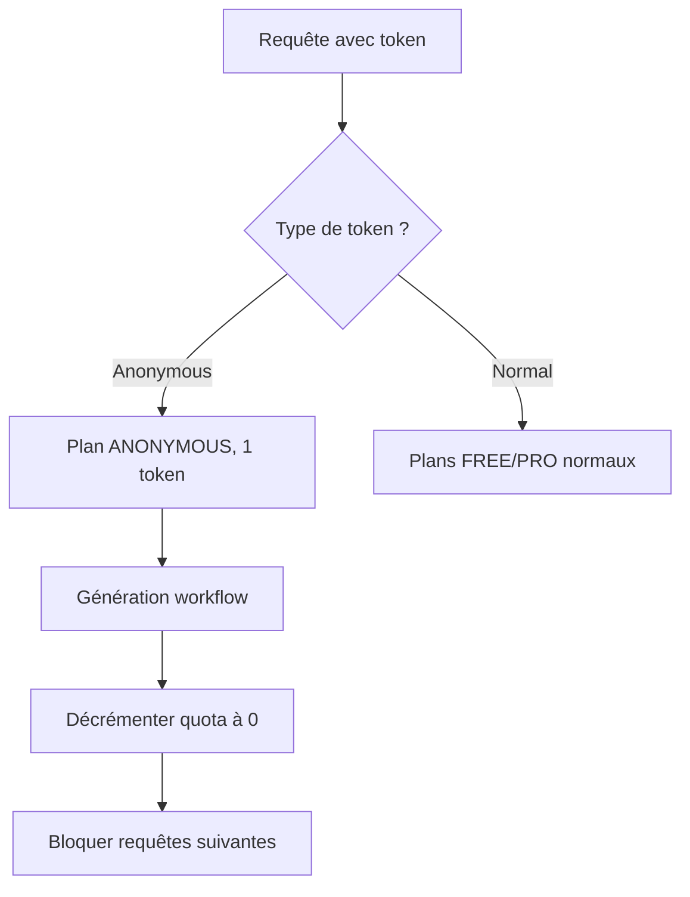

# 🎁 Free Trial Request - Documentation

Cette fonctionnalité permet aux nouveaux utilisateurs de générer **1 workflow gratuitement** avant de s'authentifier, utilisant Firebase Anonymous Auth pour une expérience fluide.

## 🎯 Objectif

- **Réduire la friction** pour les nouveaux utilisateurs
- **Permettre un premier essai** sans inscription
- **Encourager l'inscription** après démonstration de valeur
- **Maintenir la sécurité** avec quota strict de 1 requête

## 🏗️ Architecture

### Frontend (Chrome Extension)



### Backend



## 🔧 Configuration

### 1. Feature Flag

Dans `vibe-n8n-chrome-extension/src/config.js` :

```javascript
FEATURES: {
  // ... autres features
  FREE_TRIAL_REQUEST: true  // Activer/désactiver
}
```

### 2. Backend Firebase

Le backend reconnaît automatiquement les tokens Firebase Anonymous et applique :
- **Plan** : `ANONYMOUS`
- **Quota** : 1 token seulement
- **Restrictions** : Pas de renouvellement mensuel

## 📱 Expérience Utilisateur

### Première visite

1. **Ouverture n8n** → Pas d'auth requise
2. **Clic AI Assistant** → Pas de popup d'auth
3. **Saisie prompt** → Génération immédiate
4. **Workflow généré** → Message de succès + invitation à s'inscrire
5. **Popup d'auth** → Apparaît après 2 secondes

### Visites suivantes

1. **Ouverture n8n** → Free trial déjà utilisé
2. **Clic AI Assistant** → Auth requise immédiatement
3. **Login Google/Email** → Plans FREE/PRO normaux

## 🛠️ Implémentation Technique

### Chrome Extension

#### 1. Detection du free trial disponible

```javascript
// content-auth-integration-standalone.js
async canMakeRequest() {
  // Vérifier si le free trial est disponible
  if (CONFIG.FEATURES.FREE_TRIAL_REQUEST) {
    const storage = await chrome.storage.local.get(['n8n_free_trial_used']);
    if (!storage.n8n_free_trial_used) {
      return {
        allowed: true,
        reason: 'FREE_TRIAL_AVAILABLE',
        method: 'anonymous',
        isFreeTrial: true
      };
    }
  }
  // ... logique auth normale
}
```

#### 2. Firebase Anonymous Auth

```javascript
// background.js
async function firebaseSignInAnonymously() {
  await setupOffscreenDocument('/firebase-auth-web-extension.html');
  const result = await sendToOffscreen({
    type: 'firebase-anonymous-auth'
  });
  
  if (result && result.success) {
    await chrome.storage.local.set({
      'n8n_anonymous_user': true,
      'n8n_anonymous_uid': result.user?.uid,
      'n8n_free_trial_used': false
    });
  }
  
  return result;
}
```

#### 3. Marquage après succès

```javascript
// Après génération réussie
if (isAnonymousUser && CONFIG.FEATURES.FREE_TRIAL_REQUEST) {
  await chrome.storage.local.set({
    'n8n_free_trial_used': true
  });
  
  // Afficher message d'invitation
  send({
    type: 'FREE_TRIAL_COMPLETE',
    message: 'Great! Your first workflow has been generated. Sign in to create unlimited workflows.'
  });
}
```

### Backend

#### 1. Détection utilisateur anonyme

```javascript
// middleware/auth.js
const isAnonymousAuth = decodedToken.firebase?.sign_in_provider === 'anonymous';

const user = await firebaseService.getOrCreateUser(
  decodedToken.uid, 
  decodedToken.email,
  decodedToken.email_verified || isGoogleAuth,
  isAnonymousAuth  // Nouveau paramètre
);
```

#### 2. Création utilisateur anonyme

```javascript
// services/firebase-service.js
async getOrCreateUser(uid, email = null, emailVerified = true, isAnonymous = false) {
  const newUser = {
    uid,
    email,
    plan: isAnonymous ? 'ANONYMOUS' : 'FREE',
    remaining_tokens: isAnonymous ? 1 : (emailVerified ? 70000 : 0),
    is_anonymous: isAnonymous,
    // ... autres champs
  };
}
```

## 🔒 Sécurité

### Limitations

1. **1 seule requête** par utilisateur anonyme
2. **Pas de renouvellement** des quotas anonymes
3. **Pas d'upgrade** possible depuis ANONYMOUS
4. **Détection par UID** Firebase pour éviter abus

### Mécanismes de protection

```javascript
// Vérification quota stricte
if (userData.plan === 'ANONYMOUS' && userData.remaining_tokens <= 0) {
  return { 
    allowed: false, 
    reason: 'ANONYMOUS_TRIAL_EXHAUSTED'
  };
}
```

## 📊 Monitoring

### Métriques à surveiller

1. **Taux de conversion** : Anonymous → Authenticated
2. **Usage des free trials** : Nombre par jour/semaine
3. **Taux d'abus** : Tentatives multiples même UID
4. **Performance** : Impact sur les temps de réponse

### Logs importants

```bash
# Création utilisateur anonyme
🎁 Created new ANONYMOUS user for free trial: uid12345

# Utilisation du free trial
📊 Free trial used by anonymous user: uid12345

# Tentative d'abus
⚠️ Anonymous user uid12345 attempting second request (blocked)
```

## 🧪 Tests

### Test automatisé

```bash
npm run test:free-trial
# ou
node scripts/test-free-trial.js
```

### Test manuel

1. **Effacer stockage** extension Chrome
2. **Ouvrir n8n** dans nouvel onglet
3. **Utiliser AI Assistant** sans login
4. **Vérifier génération** réussie
5. **Tenter 2ème requête** → Auth requise

## 🚀 Déploiement

### 1. Activation progressive

```javascript
// Déployer d'abord avec flag désactivé
FREE_TRIAL_REQUEST: false

// Puis activer graduellement
FREE_TRIAL_REQUEST: true
```

### 2. Rollback rapide

En cas de problème, désactiver immédiatement :

```javascript
FREE_TRIAL_REQUEST: false
```

Les utilisateurs passeront automatiquement à l'auth normale.

## 📈 Métriques de succès

### KPIs à mesurer

1. **Augmentation du taux d'essai** : +X% d'utilisateurs testent
2. **Conversion post-trial** : Y% s'inscrivent après trial
3. **Réduction de l'abandon** : -Z% abandon au premier clic
4. **Qualité des workflows** : Free trials génèrent des workflows valides

### Dashboard recommandé

- Nombre de free trials/jour
- Taux de conversion anonymous → authenticated  
- Top prompts des free trials
- Temps moyen entre trial et inscription

---

## 🎯 Utilisation recommandée

Cette fonctionnalité est particulièrement efficace pour :

✅ **Nouveaux utilisateurs** découvrant l'outil  
✅ **Démonstrations** et présentations  
✅ **Réduction friction** d'onboarding  
✅ **A/B testing** de l'expérience utilisateur  

**Développé avec ❤️ pour améliorer l'adoption de l'assistant n8n IA** 