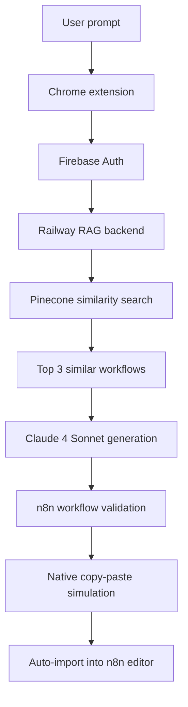

# n8n AI Assistant – Chrome Extension

Smart Chrome extension that embeds a full RAG workflow-generation system directly inside the n8n UI. Create complete, production-ready workflows from plain-language descriptions, powered by 2,000+ real examples, Firebase Auth, and built-in quota management.

## 🚀 Features

### 🤖 Advanced AI Generation
- **Integrated RAG assistant** – generates workflows based on 2,000+ real examples
- **Anthropic Claude 4 Sonnet** – latest-generation LLM
- **Real-time streaming** – watch generation progress live
- **“Improve” mode** – refine or extend existing workflows

### 🔐 Modern Authentication  
- **Firebase Auth** – secure Google sign-in
- **FREE / PRO plans** – automatic quota management
- **Usage tracking** – live token counter

### 💫 Native n8n UI
- **Automatic import** – mimics n8n’s native copy-paste
- **Multi-domain support** – works on n8n.io, n8n.cloud, and self-hosted instances
- **Modern design** – VS Code-inspired panel with adaptive themes
- **Full validation** – generated workflows are 100 % n8n-compatible

## 📋 Plans & Quotas

### FREE Plan
- **70 000 input tokens** per month
- AI workflow generation
- Full Chrome extension
- Community support

### PRO Plan ($20 / month)
- **1 500 000 input tokens** per month  
- Optional pay-as-you-go after quota
- Priority support
- Advanced usage stats

*Rule of thumb :* 1 simple workflow ≈ 8 000–15 000 tokens

## 🛠️ Installation

### 1. Load the extension

1. **Download**: clone or download this repo
2. **Open Chrome** ➡ `chrome://extensions/`
3. **Enable Developer mode** (top-right toggle)
4. **Load unpacked** ➜ select **vibe-n8n-chrome-extension/**
5. **Done!**  🤖 icon appears in the toolbar

### 2. First run

1. **Open n8n** (n8n.io, n8n.cloud or your own instance)
2. **Navigate** to any workflow (new or existing)
3. **Click** the blue 🤖 button (bottom-right)
4. **Sign in** with Google (Firebase Auth)
5. **Start describing** your workflow!

## 🎯 Usage

### Generate a new workflow
1. **Create** a new workflow in n8n
2. **Click** 🤖
3. **Describe** the workflow in plain English
4. **Watch** the real-time stream
5. **Done** – the workflow is auto-imported

### Improve an existing workflow
1. **Open** an existing workflow
2. **Click** 🤖
3. **Describe** what to change or add
4. **The new version** replaces the original automatically

### Prompt examples

#### Simple workflows
```text
"Create a workflow that sends an email every hour"
"Webhook trigger that notifies Slack when data arrives"
"Save new RSS articles to Google Sheets"
```

#### Complex workflows
```text
"Full e-commerce pipeline: \n- Trigger on new Shopify products\n- Auto-update HubSpot\n- Notify team via Slack\n- Send customer confirmation via Gmail\n- Error alerts in Discord"
```

#### Improve mode
```text
"Add an email notification if any step fails"
"Validate input data before processing"
"Insert a 5-minute delay between each step"
```

## 🔧 Configuration

### Production backend
The extension is pre-configured for the production backend:

```js
// vibe-n8n-chrome-extension/src/config.js
const CONFIG = {
  // Railway production backend
  API_URL: 'https://vibe-n8n-production.up.railway.app/api/claude',
  API_BASE_URL: 'https://vibe-n8n-production.up.railway.app',

  // Firebase
  FIREBASE_CONFIG: {
    apiKey: '***',
    authDomain: 'vibe-n8n-7e40d.firebaseapp.com',
    projectId: 'vibe-n8n-7e40d',
    // …other params
  },

  // Feature flags
  FEATURES: {
    FIREBASE_AUTH: true,
    PRICING_SYSTEM: true,
    SUBSCRIPTION_PLANS: true,
    RAG_WORKFLOW_GENERATION: true,
    STREAMING_RESPONSE: true,
  },
};
```

### Custom domains
To enable the extension on your own n8n instance:

1. **Open** your n8n domain
2. **Click** the 🤖 icon in Chrome
3. **Press** “Enable on this domain”
4. Domain is saved – reload and you’re good

## 🏗️ Technical overview

### File structure
```text
vibe-n8n-chrome-extension/
├── manifest.json              # Manifest V3
├── popup.html                 # Domain-activation UI
├── offscreen.html             # Firebase Auth container
├── src/
│   ├── background.js          # Service Worker ↔ backend
│   ├── content.js             # Main in-page UI (3 600+ LoC)
│   ├── inject.js              # Pinia access + native import
│   ├── popup.js               # Popup logic
│   ├── config.js              # Central config
│   └── content-auth-integration-standalone.js
├── styles/
│   ├── panel.css
│   ├── popup.css
│   └── auth.css
└── assets/
    └── icon*.png
```

### Generation flow



### Firebase Auth
Uses the official Manifest V3 off-screen-document pattern for Google sign-in. Tokens are refreshed automatically; quotas sync in real time.

## 💻 Advanced features

### 🎯 Native import (copy-paste simulation)
```js
// 1. Put the workflow JSON on the clipboard
await navigator.clipboard.writeText(workflowJSON);

// 2. Focus the n8n editor
const canvas = document.querySelector('[data-test-id="canvas"]');
canvas.focus();

// 3. Simulate Ctrl+V
const pasteEvt = new ClipboardEvent('paste', { clipboardData: new DataTransfer() });
canvas.dispatchEvent(pasteEvt);
```

### 🔄 Streaming with live feedback
```js
// Listen to SSE events from the backend
source.onmessage = (e) => {
  const data = JSON.parse(e.data);
  switch (data.type) {
    case 'setup':      updateUI('Initializing RAG service…'); break;
    case 'search':     updateUI('Searching similar workflows…'); break;
    case 'claude_call':updateUI('Generating with Claude 4 Sonnet…'); break;
    case 'complete':   importWorkflow(data.data.workflow); break;
  }
};
```

### ✅ Full validation
Ensures the workflow is structurally sound before import:
```js
validateWorkflowStructure(workflow);
workflow.nodes.forEach(validateNode);
validateConnections(workflow.connections);
fixCommonIssues(workflow);
```

## 📊 UI Highlights
- Modern chat panel with streaming feedback
- Quota bar and plan information
- History of recent generations
- Quick-action buttons

## 🔍 Troubleshooting

| Issue | Possible fixes |
|-------|----------------|
| 🤖 button missing | 1) Ensure you’re on an n8n workflow page 2) Reload (Ctrl + R) 3) Check `chrome://extensions` |
| Auth errors | 1) Sign out in the panel, then sign in again 2) Allow pop-ups 3) Grant clipboard permission |
| Workflow not imported | 1) Check n8n edit permissions 2) Ensure you’re in the editor view 3) Open DevTools for errors |
| Quota exceeded | 1) Wait for monthly reset (FREE) 2) Upgrade to PRO 3) Check usage stats |

### Enable verbose logs
```js
// DevTools console
localStorage.setItem('n8n-ai-debug', 'true');
location.reload();
```

## 🚀 Development

### Local backend
```js
// src/config.js
const CONFIG = {
  API_URL: 'http://localhost:3000/api/claude',
  API_BASE_URL: 'http://localhost:3000',
  // …other params stay the same
};
```

### Quick test
```bash
# Start local backend
npm run dev

# Reload extension in chrome://extensions
# Test on n8n.io or your local instance
```

## 🔒 Security & Privacy
- **No server-side storage** of generated workflows
- **Short-lived Firebase tokens**; data sent over HTTPS only
- **No ads or analytics tracking**

Permissions required:
- `activeTab` – interact with the current n8n tab only
- `scripting` – inject scripts into n8n
- `storage` – save local preferences
- `offscreen` – handle Firebase Auth in an isolated document

## 📄 License
MIT License – fully compatible with the n8n open-source ecosystem.

## 🙏 Support
- **Docs** – this README & API docs
- **Issues** – GitHub for bugs & feature requests
- **Community** – n8n Discord server
- **PRO users** – priority email support

---
Built with ❤️ for the n8n community – powered by Claude 4 Sonnet, Firebase Auth, and 2 000+ real-world workflows. 