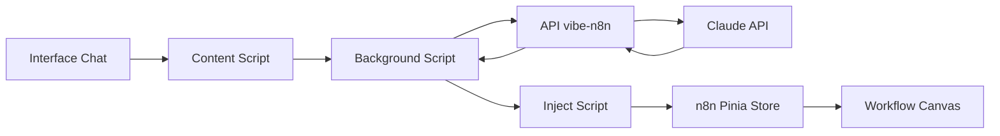

# n8n AI Assistant - Extension Chrome

Extension Chrome qui intègre Claude 4 Sonnet directement dans l'interface n8n pour créer et modifier des workflows en langage naturel.

## 🚀 Fonctionnalités

- **Assistant IA intégré** : Panneau latéral discret avec Claude 4 Sonnet
- **Création de workflows** : Décrivez votre workflow, l'IA le crée pour vous
- **Modifications intelligentes** : "Remplace Slack par Discord", "Ajoute un filtre", etc.
- **Animations visuelles** : Feedback visuel lors de la création/modification des nœuds
- **Mode streaming** : Réponses en temps réel avec affichage progressif
- **Zero configuration** : Fonctionne immédiatement, pas de clé API nécessaire

## 📋 Prérequis

- Chrome ou navigateur basé sur Chromium (Edge, Brave, etc.)
- Compte n8n (cloud ou self-hosted)
- Être sur une page de workflow n8n

## 🛠️ Installation

### Option 1 : Installation depuis le code source

1. Clonez ce repository :
```bash
git clone https://github.com/tirones-123/vibe-n8n
cd cursor-n8n
```

2. Ouvrez Chrome et accédez à `chrome://extensions/`

3. Activez le "Mode développeur" en haut à droite

4. Cliquez sur "Charger l'extension non empaquetée"

5. Sélectionnez le dossier du projet cloné

6. L'extension est maintenant installée ! Vous verrez l'icône 🤖 dans votre barre d'extensions

### Option 2 : Installation depuis le Chrome Web Store

*(À venir)*

## 💡 Utilisation

### Démarrage rapide

1. **Ouvrez n8n** dans votre navigateur
2. **Naviguez vers un workflow** (nouveau ou existant)
3. **Cliquez sur le bouton bleu 🤖** en bas à droite
4. **Décrivez votre besoin** dans le chat

### Exemples de commandes

#### Création de workflows
   - "Crée un workflow qui récupère les tweets mentionnant @moncompte et les envoie sur Slack"
- "Fait moi une automatisation qui envoie un mail à chaque fois que j'ajoute un produit sur Shopify"
- "Crée un workflow qui synchronise Google Sheets avec Notion"

#### Modifications
- "Remplace le nœud Slack par un nœud Discord"
- "Ajoute un filtre pour ne garder que les emails importants"
- "Connecte le nœud HTTP Request au nœud Telegram"
- "Supprime le nœud de filtrage"

#### Questions
- "Comment configurer l'authentification OAuth2 ?"
- "Quelle est la différence entre un webhook et un trigger ?"

## 🏗️ Architecture technique

### Structure du projet

```
cursor-n8n/
├── manifest.json          # Configuration Chrome Extension (Manifest V3)
├── src/
│   ├── background.js      # Service Worker - Communication avec l'API Claude
│   ├── content.js         # Content Script - Interface utilisateur
│   ├── inject.js          # Script injecté - Accès direct à Pinia/n8n
│   ├── config.js          # Configuration de l'API
│   └── popup.js           # Script de la popup Chrome
├── styles/
│   ├── panel.css          # Styles du panneau latéral
│   └── popup.css          # Styles de la popup
├── assets/
│   └── icon*.png          # Icônes de l'extension
├── popup.html             # Interface de la popup
└── API_DOCUMENTATION.md   # Documentation complète de l'API
```

### Flux de données



### Technologies utilisées

- **Frontend** : Vanilla JavaScript (ES6+)
- **Extension** : Chrome Extension Manifest V3
- **Backend** : API REST sur Vercel
- **IA** : Claude 4 Sonnet (Anthropic)
- **Communication** : Server-Sent Events (SSE)

## 🔧 API Backend

L'extension utilise l'API vibe-n8n hébergée sur Vercel :

- **Endpoint** : `https://vibe-n8n.vercel.app/api/claude`
- **Authentification** : Token Bearer inclus
- **Modèle IA** : Claude Sonnet 4 (dernière version)
- **Format** : Streaming SSE pour les réponses en temps réel

### Fonctions disponibles

L'assistant peut exécuter ces actions dans n8n :

- `createNode` : Créer un nouveau nœud
- `updateNode` : Modifier les paramètres d'un nœud
- `connectNodes` : Connecter deux nœuds
- `deleteNode` : Supprimer un nœud

## 🔒 Sécurité et confidentialité

- ✅ Aucune donnée sensible stockée localement
- ✅ Communication chiffrée HTTPS
- ✅ Token d'API sécurisé
- ✅ Accès limité aux domaines n8n configurés
- ✅ Pas de tracking ou analytics

## 🐛 Dépannage

### L'assistant ne répond pas

1. Vérifiez que vous êtes bien sur une page de workflow n8n
2. Rechargez la page (Ctrl+R ou Cmd+R)
3. Vérifiez votre connexion internet

### "Pinia non trouvé" ou "workflowStore non trouvé"

1. Assurez-vous d'être sur une page de workflow (pas sur la liste des workflows)
2. Attendez que la page soit complètement chargée
3. Rechargez l'extension dans `chrome://extensions/`

### Le bouton n'apparaît pas

1. Vérifiez que l'extension est activée dans Chrome
2. Vérifiez que vous êtes sur un domaine n8n autorisé
3. Inspectez la console pour les erreurs (F12)

### Les nœuds ne se créent pas

1. Vérifiez que vous avez les permissions d'édition sur le workflow
2. Assurez-vous que le type de nœud demandé existe
3. Essayez avec des commandes plus simples

## 🤝 Contribution

Les contributions sont les bienvenues ! 

### Comment contribuer

1. Fork le projet
2. Créez une branche (`git checkout -b feature/amelioration`)
3. Committez vos changements (`git commit -am 'Ajout de fonctionnalité'`)
4. Push la branche (`git push origin feature/amelioration`)
5. Ouvrez une Pull Request

### Guidelines

- Respectez le style de code existant
- Ajoutez des commentaires pour les parties complexes
- Testez sur différentes versions de n8n
- Mettez à jour la documentation si nécessaire

## 📊 Roadmap

- [ ] Support multi-langues
- [ ] Historique des conversations
- [ ] Templates de workflows pré-définis
- [ ] Export/Import de workflows
- [ ] Mode sombre
- [ ] Raccourcis clavier
- [ ] Support des variables d'environnement n8n

## 📄 Licence

MIT License - voir le fichier [LICENSE](LICENSE) pour plus de détails.

## 🙏 Remerciements

- [n8n](https://n8n.io) - Plateforme d'automatisation open source
- [Anthropic](https://anthropic.com) - Pour Claude API
- [Vercel](https://vercel.com) - Hébergement du backend
- La communauté n8n pour les retours et suggestions

## 📞 Support

- **Issues GitHub** : [github.com/tirones-123/vibe-n8n/issues](https://github.com/tirones-123/vibe-n8n/issues)
- **Documentation API** : Voir [API_DOCUMENTATION.md](API_DOCUMENTATION.md)
- **Communauté n8n** : [community.n8n.io](https://community.n8n.io)

---

**Note** : Cette extension n'est pas officiellement affiliée à n8n GmbH ou Anthropic.

*Développé avec ❤️ pour la communauté n8n* 