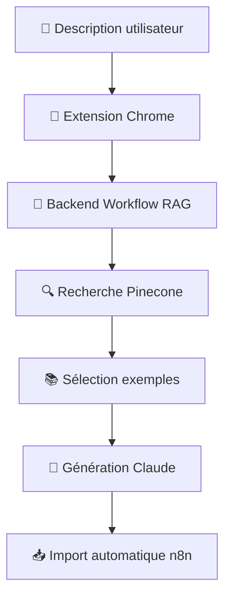
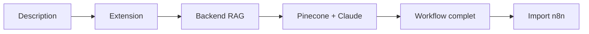

# n8n AI Assistant - Extension Chrome (Workflow RAG)

Extension Chrome qui intègre le système workflow RAG directement dans l'interface n8n pour générer des workflows complets en langage naturel basés sur 2055+ exemples réels.

## 🚀 Fonctionnalités

- **Assistant IA RAG intégré** : Panneau latéral avec génération de workflows basée sur RAG
- **Génération complète** : Décrivez votre besoin, l'IA génère le workflow complet
- **Base de 2055+ exemples** : RAG basé sur des workflows réels pour une meilleure précision
- **Import automatique** : Les workflows générés sont automatiquement importés dans n8n
- **Streaming en temps réel** : Suivi en direct de la génération avec feedback de progression
- **Explications détaillées** : Chaque workflow généré vient avec une explication complète

## 📋 Prérequis

- Chrome ou navigateur basé sur Chromium (Edge, Brave, etc.)
- Compte n8n (cloud ou self-hosted)
- Backend workflow RAG en cours d'exécution

## 🛠️ Installation

### 1. Configuration du Backend

Assurez-vous que le backend workflow RAG est démarré :

```bash
# Dans le dossier racine du projet
cd /Users/maximemarsal/cursor-n8n-backend
npm start

# Le backend devrait être accessible sur http://localhost:3000
```

### 2. Configuration de l'Extension

Modifiez le fichier `src/config.js` avec vos paramètres :

```javascript
const CONFIG = {
  API_URL: 'http://localhost:3000/api/claude', // URL de votre backend
  API_KEY: 'your-token-securise', // Votre BACKEND_API_KEY
  // ...
};
```

### 3. Installation de l'Extension

1. Ouvrez Chrome et accédez à `chrome://extensions/`
2. Activez le "Mode développeur" en haut à droite
3. Cliquez sur "Charger l'extension non empaquetée"
4. Sélectionnez le dossier `vibe-n8n-chrome-extension/`
5. L'extension est maintenant installée ! Vous verrez l'icône 🤖 dans votre barre d'extensions

## 💡 Utilisation

### Démarrage rapide

1. **Démarrez le backend** : `npm start` dans le dossier racine
2. **Ouvrez n8n** dans votre navigateur
3. **Naviguez vers un workflow** (nouveau ou existant)
4. **Cliquez sur le bouton bleu 🤖** en bas à droite
5. **Décrivez votre workflow** dans le chat

### Exemples de descriptions

#### Workflows simples
- "Crée un workflow qui envoie un email toutes les heures"
- "Workflow simple avec un trigger manuel et une requête HTTP"
- "Automatisation qui sauvegarde des données dans Google Sheets"

#### Workflows complexes
- "Crée un workflow qui synchronise Slack avec Notion toutes les heures : récupère les nouveaux messages d'un canal Slack, les transforme en pages Notion et envoie une notification Discord en cas d'erreur"
- "Automatisation complète e-commerce : trigger sur nouveaux produits Shopify, mise à jour HubSpot, notification équipe via Slack et email client via Gmail"
- "Workflow de monitoring : vérification APIs externes toutes les 10 minutes, stockage résultats dans base de données, alertes Telegram si problème"

#### Intégrations spécifiques
- "Synchronisation bidirectionnelle entre Airtable et Notion avec gestion des conflits"
- "Pipeline de traitement de fichiers : upload Dropbox → analyse contenu → génération rapport → envoi par email"
- "Bot Discord intelligent qui utilise OpenAI pour répondre aux questions des utilisateurs"

## 🔧 Architecture technique

### Workflow de génération



### Structure du projet

```
vibe-n8n-chrome-extension/
├── manifest.json          # Configuration Chrome Extension (Manifest V3)
├── src/
│   ├── background.js      # Service Worker - Communication backend RAG
│   ├── content.js         # Content Script - Interface utilisateur
│   ├── inject.js          # Script injecté - Import workflows
│   └── config.js          # Configuration backend RAG
├── styles/
│   ├── panel.css          # Styles du panneau latéral
│   └── popup.css          # Styles de la popup
├── assets/
│   └── icon*.png          # Icônes de l'extension
└── popup.html             # Interface de la popup
```

### Flux de données



## 🎯 Système RAG

### Base de connaissances
- **2055+ workflows** réels indexés dans Pinecone
- **Recherche sémantique** pour trouver les exemples les plus pertinents
- **Génération contextuelle** avec Claude basée sur les exemples

### Process de génération
1. **Analyse** de votre description
2. **Recherche** des workflows similaires dans la base
3. **Sélection** des 3 meilleurs exemples
4. **Génération** d'un nouveau workflow par Claude
5. **Import automatique** dans votre instance n8n

## 📊 Exemples de résultats

### Input
> "Crée un workflow qui synchronise Slack avec Notion toutes les heures"

### Output généré
```json
{
  "workflow": {
    "name": "Slack to Notion Sync",
    "nodes": [
      {
        "name": "Schedule Trigger",
        "type": "n8n-nodes-base.scheduleTrigger",
        "parameters": { "rule": { "interval": [{ "field": "hours", "value": 1 }] } }
      },
      {
        "name": "Slack",
        "type": "n8n-nodes-base.slack",
        "parameters": { "operation": "getMany", "resource": "message" }
      },
      {
        "name": "Notion",
        "type": "n8n-nodes-base.notion", 
        "parameters": { "operation": "create", "resource": "page" }
      }
    ],
    "connections": { /* ... */ }
  },
  "explanation": {
    "summary": "Workflow de synchronisation automatique Slack vers Notion",
    "flow": "Se déclenche toutes les heures, récupère les messages Slack et les crée comme pages Notion",
    "nodes": "Schedule Trigger (déclenchement), Slack (récupération), Notion (création)",
    "notes": "Configurez les credentials Slack et Notion avant utilisation"
  }
}
```

## 🔍 Dépannage

### Le backend ne répond pas

1. Vérifiez que le backend est démarré : `npm start`
2. Vérifiez l'URL dans `src/config.js`
3. Vérifiez les logs du backend

### L'extension ne se charge pas

1. Vérifiez que vous êtes sur une page de workflow n8n
2. Rechargez la page (Ctrl+R ou Cmd+R)
3. Vérifiez l'extension dans `chrome://extensions/`

### Les workflows ne s'importent pas

1. Vérifiez que vous avez les permissions d'édition sur le workflow
2. Regardez la console Chrome (F12) pour les erreurs
3. Essayez de recharger la page n8n

### Configuration backend

Vérifiez votre fichier `.env` dans le backend :
```env
PINECONE_API_KEY=votre_clé_pinecone
OPENAI_API_KEY=votre_clé_openai  
CLAUDE_API_KEY=votre_clé_anthropic
BACKEND_API_KEY=your-token-securise
```

## 🚀 Déploiement en production

### Backend sur Railway/Vercel
1. Déployez le backend sur Railway ou Vercel
2. Configurez les variables d'environnement
3. Mettez à jour l'`API_URL` dans l'extension

### Extension sur Chrome Web Store
1. Packagez l'extension : `zip -r extension.zip * -x "*.md" "test-*"`
2. Soumettez sur le Chrome Web Store
3. Attendez l'approbation Google

## 📈 Comparaison avec l'ancien système

| Fonctionnalité | Ancien (Tool calls) | Nouveau (Workflow RAG) |
|---|---|---|
| **Type de génération** | Modifications incrémentales | Workflows complets |
| **Base de connaissances** | Métadonnées limitées | 2055+ workflows réels |
| **Précision** | Variable | Très élevée (RAG) |
| **Facilité d'usage** | Complexe | Simple (description → workflow) |
| **Performance** | 3-8 secondes | 5-15 secondes |
| **Qualité résultats** | Basique | Professionnelle |

## 📄 License

MIT License - voir le fichier [LICENSE](LICENSE) pour plus de détails.

## 🙏 Remerciements

- [n8n](https://n8n.io) - Plateforme d'automatisation open source
- [Anthropic](https://anthropic.com) - Pour Claude API
- [Pinecone](https://pinecone.io) - Pour la base vectorielle
- [OpenAI](https://openai.com) - Pour les embeddings

---

**Note** : Cette extension n'est pas officiellement affiliée à n8n GmbH ou Anthropic.

*Développé avec ❤️ pour la communauté n8n avec le système workflow RAG* 