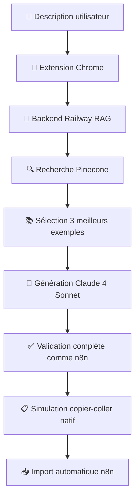

# n8n AI Assistant - Extension Chrome (Workflow RAG)

Extension Chrome qui intègre le système workflow RAG directement dans l'interface n8n pour générer des workflows complets en langage naturel basés sur 2055+ exemples réels.

## 🚀 Fonctionnalités

- **Assistant IA RAG intégré** : Panneau latéral avec génération de workflows basée sur RAG
- **Génération complète** : Décrivez votre besoin, l'IA génère le workflow complet
- **Base de 2055+ exemples** : RAG basé sur des workflows réels pour une meilleure précision
- **Import automatique natif** : Simulation du copier-coller natif n8n (aucune API requise)
- **Streaming en temps réel** : Suivi en direct de la génération avec feedback de progression
- **Support domaines personnalisés** : Activation manuelle sur n'importe quel domaine n8n
- **Interface moderne** : Design inspiré de VS Code/Monaco avec thèmes adaptatifs
- **Validation complète** : Système de validation des workflows identique à n8n natif
- **Keep-alive intelligent** : Maintien automatique du service worker pendant la génération
- **Amélioration de workflows** : Mode amélioration pour modifier des workflows existants

## 📋 Prérequis

- Chrome ou navigateur basé sur Chromium (Edge, Brave, etc.)
- Compte n8n (cloud ou self-hosted)
- Backend workflow RAG en cours d'exécution

## 🛠️ Installation

### 1. Configuration du Backend

Le backend est déployé sur Railway (production) :

```bash
# URL Production (Railway)
https://vibe-n8n-production.up.railway.app/api/claude

# URL Backup (Vercel)
https://vibe-n8n.vercel.app/api/claude

# URL Locale (développement)
http://localhost:3000/api/claude
```

### 2. Configuration de l'Extension

L'extension est préconfigurée dans `src/config.js` :

```javascript
const CONFIG = {
  // URL Production Railway (active)
  API_URL: 'https://vibe-n8n-production.up.railway.app/api/claude',
  
  // Clé d'authentification
  API_KEY: 'd5783369f695dfe8517a0c02d9b8cddf11036fec2831e04da5084e894bca7ea2',
  
  // Timeout pour les requêtes longues
  API_TIMEOUT: 900000, // 15 minutes
  
  // Fonctionnalités activées
  FEATURES: {
    RAG_WORKFLOW_GENERATION: true,
    STREAMING_RESPONSE: true,
    COMPLETE_WORKFLOW_GENERATION: true,
    WORKFLOW_EXPLANATION: true
  }
};
```

### 3. Installation de l'Extension

1. Ouvrez Chrome et accédez à `chrome://extensions/`
2. Activez le "Mode développeur" en haut à droite
3. Cliquez sur "Charger l'extension non empaquetée"
4. Sélectionnez le dossier `vibe-n8n-chrome-extension/`
5. L'extension est maintenant installée ! Vous verrez l'icône 🤖 dans votre barre d'extensions

## 💡 Utilisation

### Démarrage rapide

1. **Ouvrez n8n** dans votre navigateur (n8n.io, n8n.cloud, ou instance personnelle)
2. **Naviguez vers un workflow** (nouveau ou existant)
3. **Cliquez sur le bouton bleu 🤖** en bas à droite
4. **Décrivez votre workflow** dans le chat
5. **Le workflow sera automatiquement importé** via simulation du copier-coller natif

### Domaines personnalisés

Pour activer l'extension sur votre instance n8n personnelle :

1. **Naviguez** vers votre instance n8n
2. **Cliquez** sur l'icône de l'extension dans la barre d'outils
3. **Cliquez** sur "Activer sur ce domaine"
4. **Le domaine sera sauvegardé** pour les futures visites

### Modes d'utilisation

#### Mode Génération (nouveau workflow)
- Décrit votre besoin et génère un workflow complet
- Import automatique via simulation copier-coller

#### Mode Amélioration (workflow existant)
- Analyse le workflow actuel et propose des améliorations
- Remplace automatiquement le workflow existant

### Exemples de descriptions

#### Workflows simples
- "Crée un workflow qui envoie un email toutes les heures"
- "Workflow simple avec un trigger manuel et une requête HTTP"
- "Automatisation qui sauvegarde des données dans Google Sheets"

#### Workflows complexes
- "Crée un workflow qui synchronise Slack avec Notion toutes les heures : récupère les nouveaux messages d'un canal Slack, les transforme en pages Notion et envoie une notification Discord en cas d'erreur"
- "Automatisation complète e-commerce : trigger sur nouveaux produits Shopify, mise à jour HubSpot, notification équipe via Slack et email client via Gmail"
- "Workflow de monitoring : vérification APIs externes toutes les 10 minutes, stockage résultats dans base de données, alertes Telegram si problème"

#### Intégrations spécifiques
- "Synchronisation bidirectionnelle entre Airtable et Notion avec gestion des conflits"
- "Pipeline de traitement de fichiers : upload Dropbox → analyse contenu → génération rapport → envoi par email"
- "Bot Discord intelligent qui utilise OpenAI pour répondre aux questions des utilisateurs"

## 🔧 Architecture technique

### Structure du projet

```
vibe-n8n-chrome-extension/
├── manifest.json          # Manifest V3 - Configuration Extension
├── src/
│   ├── background.js      # Service Worker - Communication backend RAG
│   ├── content.js         # Interface utilisateur et détection n8n
│   ├── inject.js          # Accès Pinia et import natif workflows
│   ├── popup.js           # Popup activation domaines personnalisés
│   └── config.js          # Configuration centralisée
├── styles/
│   ├── panel.css          # Styles interface principale
│   └── popup.css          # Styles popup
├── assets/
│   └── icon*.png          # Icônes extension
└── popup.html             # Interface popup
```

### Workflow de génération



### Fonctionnalités avancées

#### 🎯 Import Natif (Simulation Copier-Coller)
```javascript
// L'extension simule exactement le copier-coller natif de n8n
// 1. Met le JSON dans le clipboard
await navigator.clipboard.writeText(workflowJSON);

// 2. Focus sur l'éditeur n8n
editorCanvas.focus();

// 3. Simule Ctrl+V
const pasteEvent = new ClipboardEvent('paste', {
  clipboardData: new DataTransfer()
});
editorCanvas.dispatchEvent(pasteEvent);
```

#### 🔄 Keep-Alive Service Worker
```javascript
// Maintient le service worker actif pendant la génération
function openKeepAlivePort(tabId) {
  const port = chrome.tabs.connect(tabId, { name: 'rag-stream' });
  activePorts.set(tabId, port);
}
```

#### ✅ Validation Complète
```javascript
// Validation identique à n8n natif
async function validateAndFixWorkflowLikeN8n(workflowData) {
  // 1. Validation structure workflow
  // 2. Validation chaque nœud avec APIs n8n
  // 3. Validation connexions
  // 4. Correction automatique des erreurs
}
```

## 🎯 Système RAG

### Base de connaissances
- **2055+ workflows** réels indexés dans Pinecone
- **Recherche sémantique** pour trouver les exemples les plus pertinents
- **Génération contextuelle** avec Claude 4 Sonnet basée sur les 3 meilleurs exemples

### Process de génération détaillé
1. **Analyse sémantique** de votre description
2. **Recherche vectorielle** dans Pinecone (2055+ workflows)
3. **Sélection intelligente** des 3 exemples les plus pertinents
4. **Génération par Claude 4 Sonnet** avec contexte RAG
5. **Validation complète** comme n8n natif (types, paramètres, connexions)
6. **Import automatique** via simulation copier-coller
7. **Feedback en temps réel** avec streaming SSE

### Configuration RAG
```javascript
// Paramètres optimisés pour la qualité exemple
{
  model: "claude-3-5-sonnet-20241022",
  max_tokens: 8192,
  temperature: 0.1,        // Faible pour cohérence
  top_p: 0.9,
  streaming: true,         // Feedback temps réel
  examples_count: 3        // Top 3 exemples similaires
}
```

## 📊 Exemples de résultats

### Input
> "Crée un workflow qui synchronise Slack avec Notion toutes les heures"

### Output généré
```json
{
  "workflow": {
    "name": "Slack to Notion Sync",
    "nodes": [
      {
        "name": "Schedule Trigger",
        "type": "n8n-nodes-base.scheduleTrigger",
        "parameters": { 
          "rule": { 
            "interval": [{ "field": "hours", "value": 1 }] 
          } 
        },
        "position": [100, 100],
        "typeVersion": 1.1
      },
      {
        "name": "Slack",
        "type": "n8n-nodes-base.slack",
        "parameters": { 
          "operation": "getMany", 
          "resource": "message",
          "options": { "limit": 50 }
        },
        "position": [300, 100],
        "typeVersion": 2.1
      },
      {
        "name": "Transform Data",
        "type": "n8n-nodes-base.set",
        "parameters": {
          "assignments": {
            "assignments": [
              {
                "id": "abc123",
                "name": "title",
                "type": "string",
                "value": "={{ $json.text }}"
              }
            ]
          }
        },
        "position": [500, 100],
        "typeVersion": 3.3
      },
      {
        "name": "Notion",
        "type": "n8n-nodes-base.notion",
        "parameters": { 
          "operation": "create", 
          "resource": "page",
          "databaseId": "your-database-id"
        },
        "position": [700, 100],
        "typeVersion": 2.2
      }
    ],
    "connections": {
      "Schedule Trigger": {
        "main": [[{ "node": "Slack", "type": "main", "index": 0 }]]
      },
      "Slack": {
        "main": [[{ "node": "Transform Data", "type": "main", "index": 0 }]]
      },
      "Transform Data": {
        "main": [[{ "node": "Notion", "type": "main", "index": 0 }]]
      }
    }
  },
  "explanation": {
    "summary": "Workflow de synchronisation automatique Slack vers Notion",
    "flow": "Se déclenche toutes les heures, récupère les nouveaux messages Slack, transforme les données et les crée comme pages Notion",
    "nodes": {
      "Schedule Trigger": "Déclenchement automatique toutes les heures",
      "Slack": "Récupération des messages du canal configuré",
      "Transform Data": "Transformation des données Slack vers format Notion",
      "Notion": "Création des pages dans la base de données"
    },
    "setup": [
      "1. Configurez les credentials Slack (OAuth2)",
      "2. Configurez les credentials Notion (API Token)",
      "3. Définissez l'ID de la base de données Notion",
      "4. Personnalisez la transformation des données si nécessaire"
    ]
  }
}
```

## 🔍 Dépannage

### Le backend ne répond pas

1. **Vérifiez la connexion** : L'extension utilise Railway par défaut
2. **Testez l'API** : `curl https://vibe-n8n-production.up.railway.app/health`
3. **Vérifiez les logs** : Ouvrez la console Chrome (F12)

### L'extension ne se charge pas

1. **Page n8n** : Vérifiez que vous êtes sur une page de workflow n8n
2. **Domaine personnalisé** : Utilisez la popup pour activer sur votre domaine
3. **Rechargement** : Rechargez la page (Ctrl+R ou Cmd+R)
4. **Extensions** : Vérifiez l'extension dans `chrome://extensions/`

### Les workflows ne s'importent pas

1. **Permissions** : Vérifiez que vous avez les droits d'édition sur le workflow
2. **Clipboard** : L'extension a besoin d'accès au clipboard
3. **Console** : Regardez la console Chrome (F12) pour les erreurs
4. **Page** : Essayez de recharger la page n8n

### Messages d'erreur courants

#### "Store Pinia non disponible"
- **Cause** : n8n pas complètement chargé
- **Solution** : Attendez le chargement complet de n8n, puis réessayez

#### "Clipboard access denied"
- **Cause** : Permissions clipboard refusées
- **Solution** : Autorisez l'accès clipboard dans les paramètres Chrome

#### "Editor canvas not found"
- **Cause** : Vous n'êtes pas sur une page d'édition de workflow
- **Solution** : Naviguez vers un workflow existant ou créez-en un nouveau

### Debug avancé

Pour activer les logs détaillés :

```javascript
// Dans la console Chrome (F12)
localStorage.setItem('n8n-ai-debug', 'true');
// Rechargez la page
```

## 🚀 Déploiement en production

### Extension packagée

1. **Préparer l'extension** :
```bash
# Nettoyer les fichiers de dev
rm -rf test-* debug-*

# Créer l'archive
zip -r n8n-ai-assistant.zip * -x "*.md" "test-*" "debug-*"
```

2. **Chrome Web Store** :
   - Soumettez l'archive sur le Chrome Web Store
   - Remplissez les métadonnées requises
   - Attendez l'approbation Google (7-14 jours)

### Backend en production

Le backend est déjà déployé sur Railway :
- **URL Production** : `https://vibe-n8n-production.up.railway.app`
- **Monitoring** : Logs disponibles sur Railway Dashboard
- **Scaling** : Auto-scaling activé pour gérer la charge

## 🔧 Développement

### Configuration locale

1. **Backend local** :
```bash
cd /path/to/cursor-n8n-backend
npm install
npm start  # Port 3000
```

2. **Extension en dev** :
```javascript
// Dans src/config.js
const CONFIG = {
  API_URL: 'http://localhost:3000/api/claude',
  // ... autres paramètres
};
```

3. **Rechargement** :
   - Modifications JS/CSS : Rechargez l'extension dans `chrome://extensions/`
   - Modifications manifest : Rechargez complètement l'extension

### Structure de développement

```
vibe-n8n-chrome-extension/
├── src/
│   ├── background.js      # Service Worker (communication backend)
│   ├── content.js         # Interface utilisateur (3600+ lignes)
│   ├── inject.js          # Accès Pinia n8n (1500+ lignes)
│   ├── popup.js           # Popup activation
│   └── config.js          # Configuration centralisée
├── styles/
│   ├── panel.css          # Interface principale (400+ lignes)
│   └── popup.css          # Styles popup
└── manifest.json          # Manifest V3
```

## 📄 License

MIT License - voir le fichier [LICENSE](LICENSE) pour plus de détails.

## 🙏 Remerciements

- [n8n](https://n8n.io) - Plateforme d'automatisation open source
- [Anthropic](https://anthropic.com) - Pour Claude 4 Sonnet API
- [Pinecone](https://pinecone.io) - Pour la base vectorielle RAG
- [Railway](https://railway.app) - Pour l'hébergement du backend
- [OpenAI](https://openai.com) - Pour les embeddings vectoriels

---

**Note** : Cette extension n'est pas officiellement affiliée à n8n GmbH ou Anthropic.

*Développé avec ❤️ pour la communauté n8n avec le système workflow RAG* 